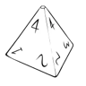
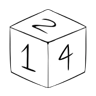
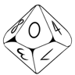

  

  <b>Roll dice. Keep the receipt.</b> 
  Public tools, specs and engineering notes from the team behind <a href="https://dnddiceroller.com">dnddiceroller.com</a>.

<picture><source media="(prefers-color-scheme: dark)" srcset="img/d4-dark.png"></picture>
<picture><source media="(prefers-color-scheme: dark)" srcset="img/d6-dark.png"></picture>
<picture><source media="(prefers-color-scheme: dark)" srcset="img/d8-dark.png"></picture>
<picture><source media="(prefers-color-scheme: dark)" srcset="img/d10-dark.png"></picture>
<picture><source media="(prefers-color-scheme: dark)" srcset="img/d12-dark.png"></picture>
<picture><source media="(prefers-color-scheme: dark)" srcset="img/d20-dark.png"></picture>

  
  
  

---

A dice roller should be fast enough for the game table, and rigorous enough that anyone curious can see what happened.

On True Randomness, every block of rolls ends with a receipt: the public beacon pulse the numbers came from, its hash, and a certificate page that checks that hash against the beacon itself. Scan the QR at the table and see for yourself.

### Open the box

| Repo | What's inside |
| --- | --- |
| [roll-verification-spec](https://github.com/dnddiceroller/roll-verification-spec) | What a roll receipt means, how a certificate is checked, and what it does not prove |
| [dice-probability-tools](https://github.com/dnddiceroller/dice-probability-tools) | Exact odds for 4d6-drop-lowest, advantage, "can I hit DC 15?" and friends |
| [examples](https://github.com/dnddiceroller/examples) | Small runnable scripts: verify a receipt against the beacon, turn a hash into a fair die face |

### What we care about

Verifiable digital dice · cryptographically secure randomness · dice probability and simulation · reproducible roll verification · RNG testing · developer tools for tabletop games

The production platform is maintained privately. What lives here is what we're happy to prove in public.

